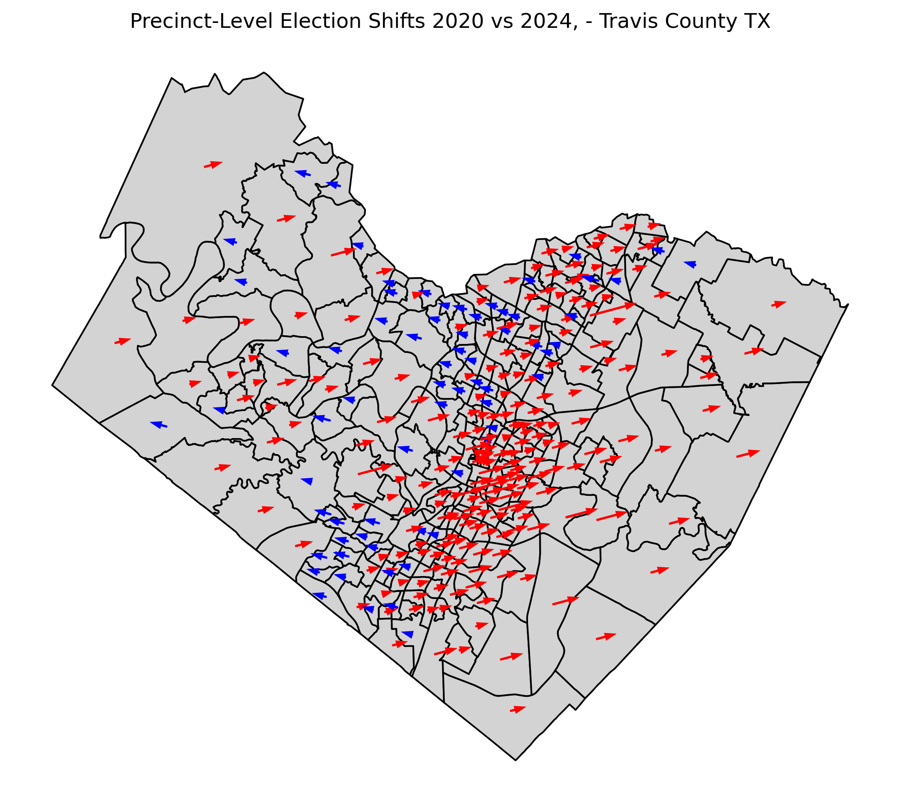

# atx-elections-data
 
A repo holding scripts for processing and visualization elections in Austin, Texas.

## prior_results_estimation

This directory stores scripts that estimate 2020 election results in the 2024-era election precincts.

## visualization

### 20_to_24 shifts

Scripts for visualizing the shift in election results from 2020 to 2024.

### registration_vs_population_growth

A bivariate choropleth map comparing voter registration growth and population growth across Texas.

