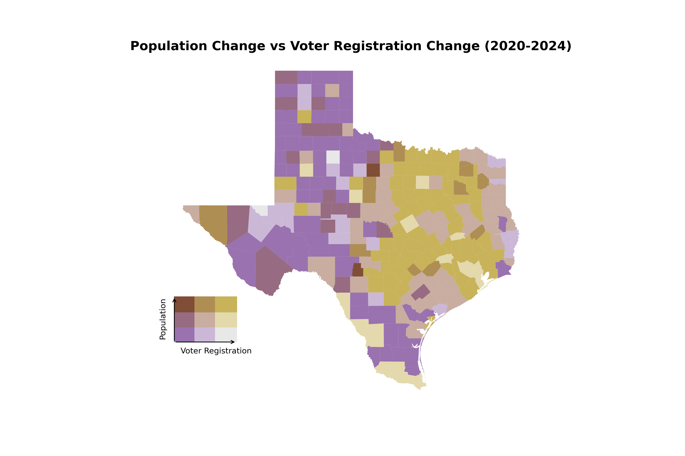
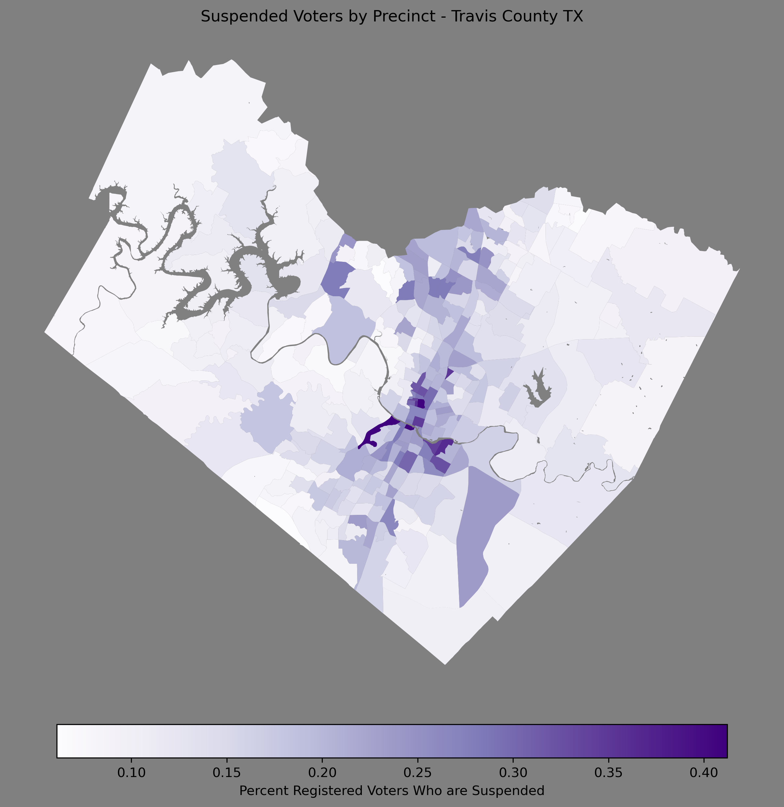
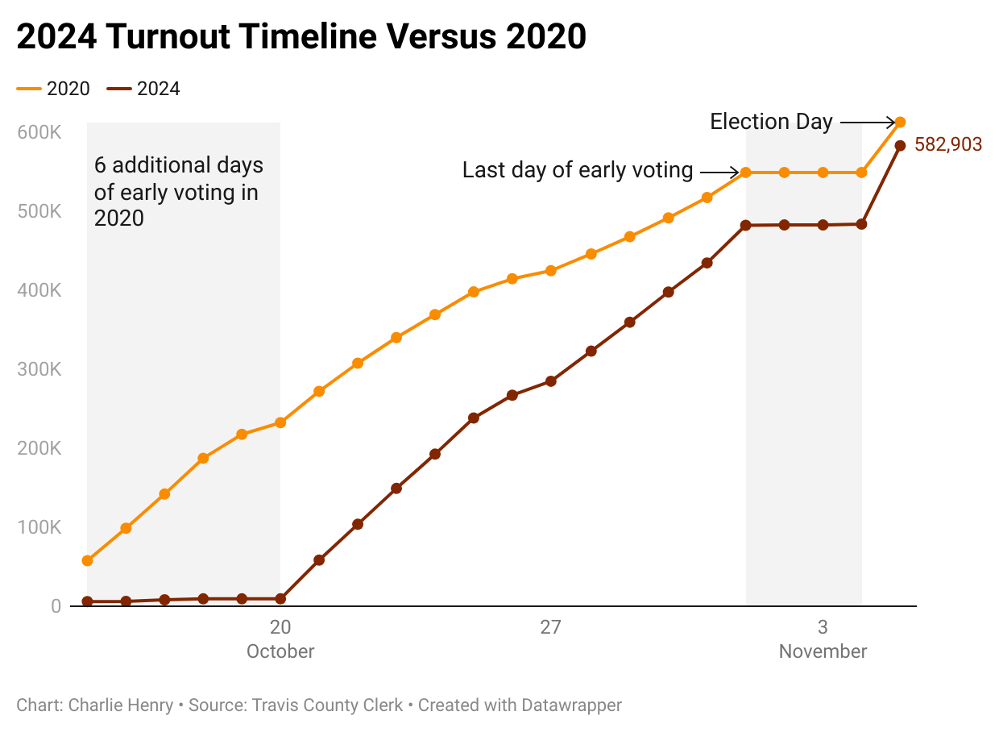

# atx-elections-data
 
A repo holding scripts for processing and visualization elections in Austin, Texas.

## prior_results_estimation

This directory stores scripts that estimate 2020 election results in the 2024-era election precincts.

## visualization

### 20_to_24 shifts

Scripts for visualizing the shift in election results from 2020 to 2024.

### registration_vs_population_growth

A bivariate choropleth map comparing voter registration growth and population growth across Texas.

### suspense_voters

Choropleth maps exploring the voter file in Travis County Texas. With a map looking at the percent of voters who were in
suspense status prior to the November 2024 election.

### 24_primary_results

Visualizations made during the night of the 2024 Texas Primaries. 

### 24_coa_council_elections

Precinct election maps for the 2024 Austin City Council elections

## etl

### travis_county_roster_scrape

This ETL was used during the 2024 early voting period to download data from the Travis County website and update a visualization
[on my blog](https://modalshift.co/early-voting/) of the turnout relative to 2020's turnout. 

